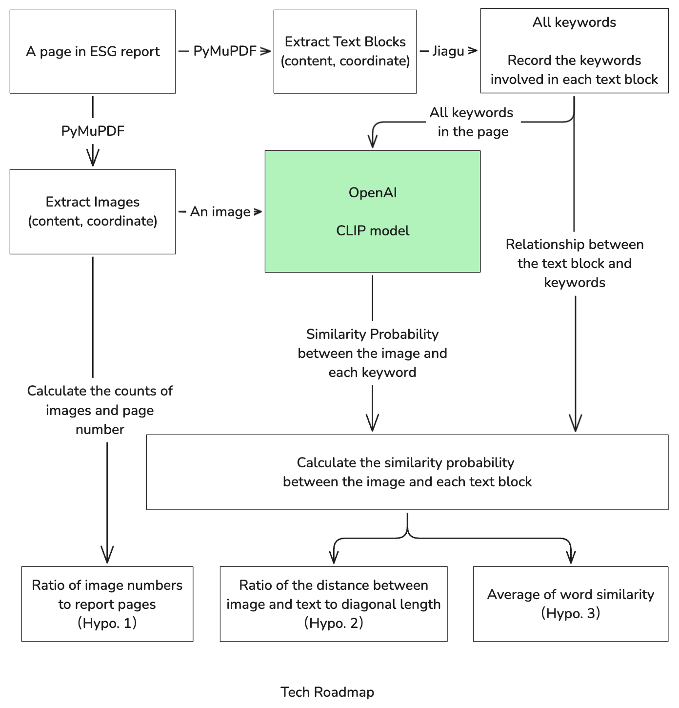

# Impact of images in ESG reports on ESG ratings based on Clip model
> Publishing this repository does not grant permission to reproduce or reuse the content without the consent of the repository owner.

## What is this project all about
This repository is built for the **ongoing** research project, which aims to provide more insights into **image-based disclosure in capital markets using the method of machine learning**. 

The hypothese are found statistically significant, more dataset are involved to improve the robustness of this research.

## Installation 
To get started, run the command line in your designated environment with: 
`pip install -r requirements.txt`

Create folder `data` and `log` respectively, the first for PDF data storage, the second for script running log. Please make sure that `.gitignore` has declared that these two folders will not be recorded by git version control. 

## Sample run
Use the data file in folder `sample_data` and conduct a pilot test. To do so, please replace `pdf_path_list = getPathBundle("data/ESG/2023")` in `main.py` to `pdf_path_list = getPathBundle("sample_data")`.

## Warning
Running `main.py` can only compute the original data based on the CLIP model. 
